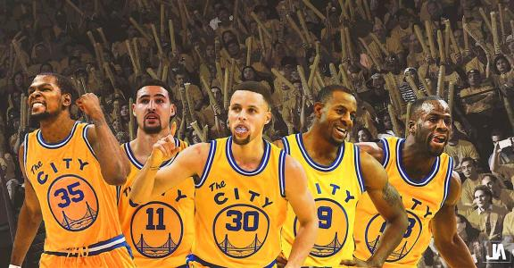
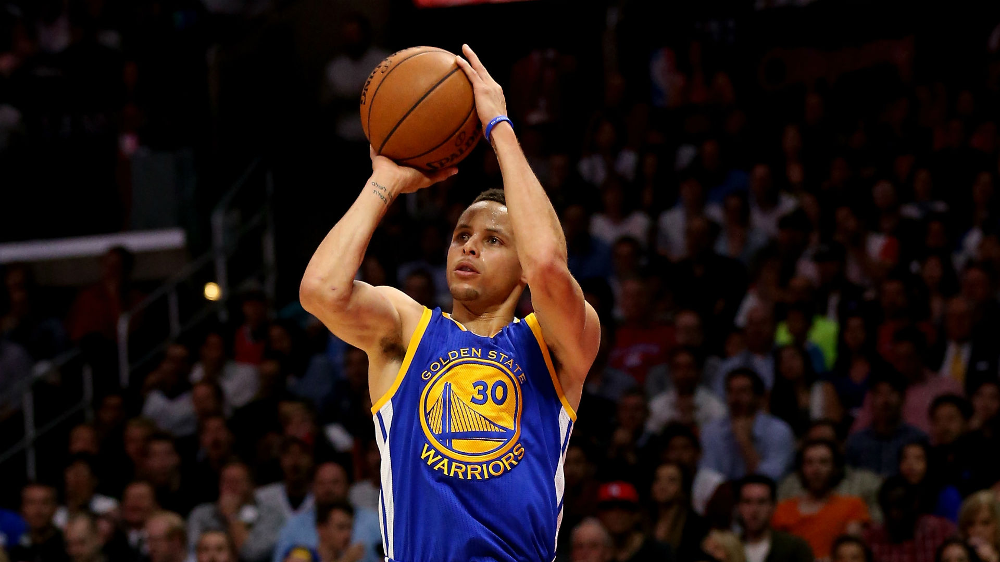
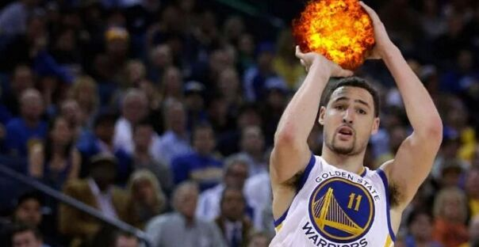
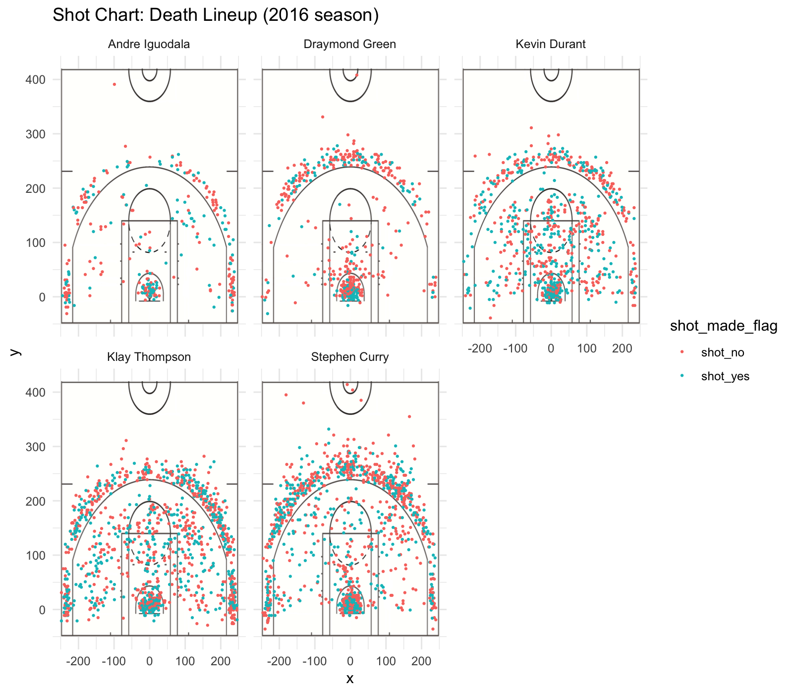
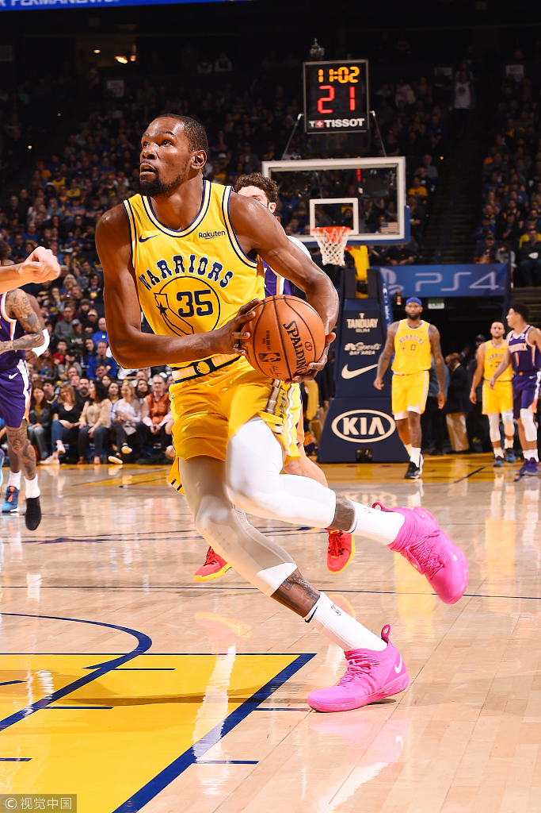
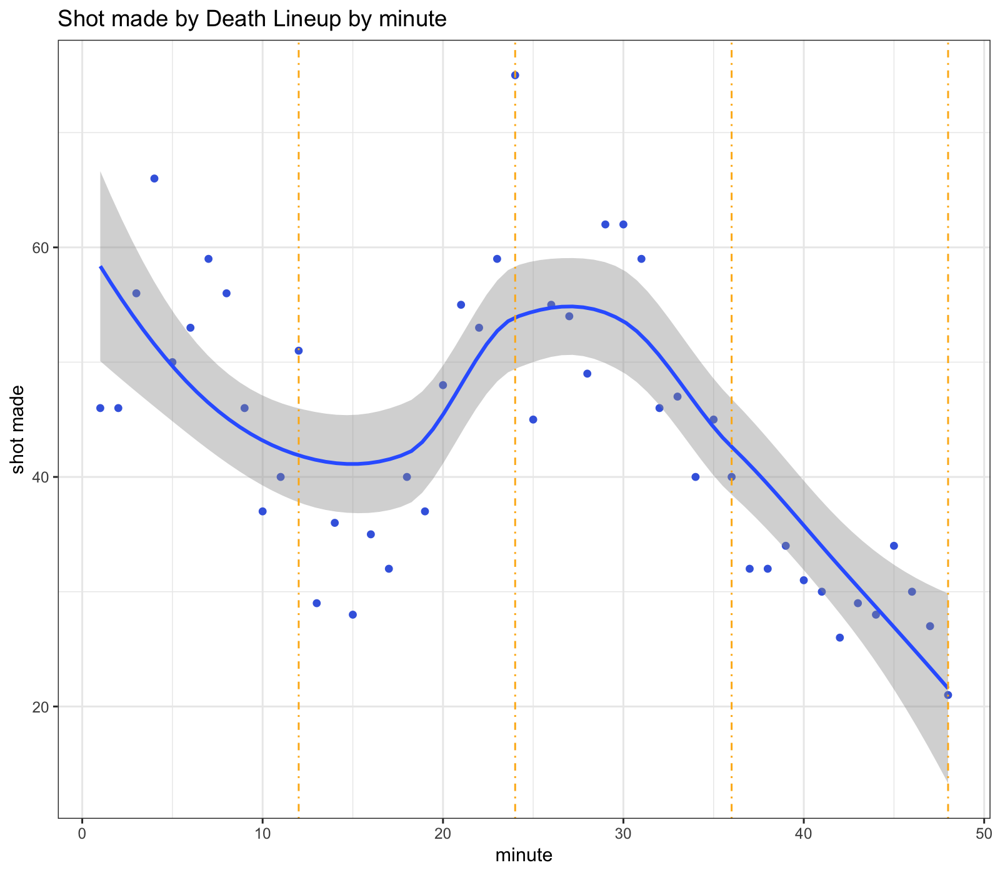
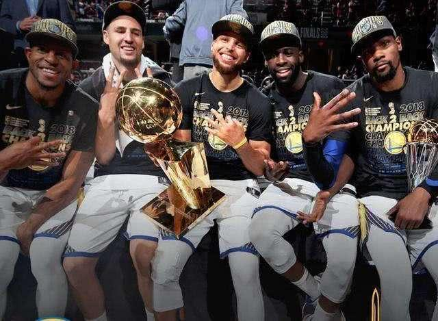

workout01-Zhengyi-Sui
================
Zhengyi Sui
3/9/2019

Golden State Warriors: Dynasty Team Rising
==========================================

**Golden State Warriors** finished a perfect regular season in 2017, and re-won their championship after a heartbroken final failure in 2016. In this season, they continued a series of amazing shows and kept creating records. They won 67 games in the regular season and played an overwhelming off season with 16-1, successfully and easily brought back the O'Brien Cup to bay area. The most shining stars of the team- the Death Lineup- Andre Iguodala, Klay Thompson, Kevin Durant, Draymond Green and Stephen Curry played crucial roles in the season. Do they deserve their so-called Death Lineup? How did they perform in the 16-17 season? The report review the shooting statistics they left after the glory.

### Phenomenal Season

Although Golden State Warriors did not break through their 73 winnings in season 2016, they still won 67 games and more imprtantly, they re-took the NBA championship to Oakland. The coach Steve Kerr's Death Lineup team, played ultimate offense and defense efficiency. Their shooting data told us how effcient they were and let's focused on their offense performance in the season 16-17.

### Data

The data includes Andre Iguodala, Klay Thompson, Kevin Durant, Draymond Green and Stephen Curry's shooting data of 2 pointers and 3 pointers and which ones were made and which were not, the shooting position in coordinates, the shooting time in minute and second and quarter, their action type, and the opponent.

### Shooting Hotspot

Here is the shooting hotspot of the Death Lineup. The Splash Brothers(Stephen Curry and Klay Thompson) made all points outside the three point line green, in other word, they had no blind angle outside the three point line. Stephen Curry, made the most three points at the head of the key, and his shooting range could be far from the back stop. It's no wondering he is one of the best three pointers in NBA history.  And Klay Thopmpson, as one of the best 3-Defense player in the league, made shoots no matter from high post to downtown.  Another famous star, the FMVP of the season, Kevin Durant performed ultimate shooting in all parts of the court, scoring from foul lane to three pointer line, proving his fame as a superstar of the league. As the most important defensive cores and organizers, Draymond Green and Andre Iguodala can also provide offensive power. The hotplot could intuitively present the spectacular offensice efficiency of the team. Obviously, their offensive power was tremendous and nearly covered all the front court, from three-second area to downtown, which also lays a solid foundation of their ultimate overall efficiency.

### Shooting Percent

Data tells us quantitatively how amazing the Death Lineup was in shooting. Here're their effective percent of 2 points, 3 points and overall shooting.
- It's amazing that all five players keep 2 pointer shooting percent above 49%, especially Kevin Durant kept it above 60% while making the most 390 shootings. Apart from that, the other two scorers Stephen Curry and Klay Thopmson also kept 54.0% and 51.4% 2 pointer shooting percent respectively, which is also striking. 

    ##             name total made perc_made
    ## 1 Andre Iguodala   210  134 0.6380952
    ## 2   Kevin Durant   643  390 0.6065319
    ## 3  Stephen Curry   563  304 0.5399645
    ## 4  Klay Thompson   640  329 0.5140625
    ## 5 Draymond Green   346  171 0.4942197

-   Outside the three point line, Splash Brothers prove their worth of their fame. Klay Thompson had a 43.4% shooting percent and Stephen Curry at 40.8%. And it's worth mentioning that Splash Brothers scored the most three pointers in the league in the seaon, respectively 280(Stephen Curry) and 246(Klay Thompson) in regular season. And the FMVP Kevin Durant also had a three points shooting percent at 38.6%, scoring 105 three pointers, always playing a stable terminator role in rush hour.

<!-- -->

    ##             name total made perc_made
    ## 1  Klay Thompson   580  246 0.4241379
    ## 2  Stephen Curry   687  280 0.4075691
    ## 3   Kevin Durant   272  105 0.3860294
    ## 4 Andre Iguodala   161   58 0.3602484
    ## 5 Draymond Green   232   74 0.3189655

-   From the aspect of overall shooting percent, Kevin Durant reached striking 54.1%, which is the most stable scorer. And the sophisticated player Andre Iguodala kept his stability all the time with overall shooting percent at 51.8%. Klay Thompson and Stephen Curry attained 47.1% and 46.7% overall shooting percent, which is also qualified for point guards having so many shootings.

<!-- -->

    ##             name total made perc_made
    ## 1   Kevin Durant   915  495 0.5409836
    ## 2 Andre Iguodala   371  192 0.5175202
    ## 3  Klay Thompson  1220  575 0.4713115
    ## 4  Stephen Curry  1250  584 0.4672000
    ## 5 Draymond Green   578  245 0.4238754

### Fire Ball Time

Golden State Warriors's offense fire is not only powerful, but also stable and constant. Put eyes on the shooting made in every minute, when the Death Lineup were on the court, they could provide power.
In the first quarter, they could always score, especially in the middle time, and it goes lower in the tail, which is explainable since all five players but Andre Iguodala are first team, and with switch in the tail period, they scored less. In the second period, as the second team are in and only Andre Iguodala on the court, the shot they made drops steeply.
When the second half begins, which is when Steve Kerr put on the Death Lineup team, the five allstars usually begin their show. They scored in and out, shooting and breaking through, always play an offensive wave to establish lead and expand the points difference. And in the end quarter, they scored less as time goes by, which is always thanks to their dominant performance in the third quarter and get off work.
Clearly, when the Death Lineup are on the court in the third quarter, they could always play fire rounds and score a lot and win the game in the end. That's the magic of chemistry of the Death Lineup, and of Steve Kerr, of Golden State Warriors.

### Dynasty Team Rising?

Obviously, the season is successful for Golden State Warriors, and it is likely they have disclosed the curtain of a new dynasty. If that occurs, they will be another dynasty team after Boston Celtics, Los Anglas Lakers, San Antonio Spurs and Chicago Bulls in the history of NBA. Assuming Golden State Warriors could keep the team players and keep healthy, the future of Golden State Warriors must be brilliant and unbeatable. How far could all star Golden State Warriors go? How long can they maintain their dominance? Time will tell, and just look forward.

